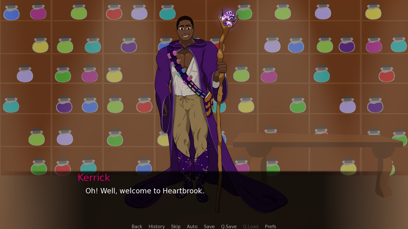
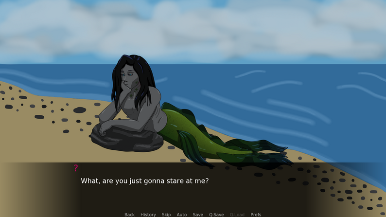
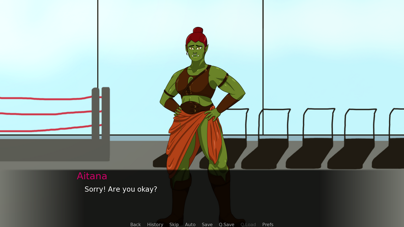

*Heartbrook* is a short dating sim developed in just under a month. It offers 3 unique characters, each with different stories and various endings. As the player, you make choices and talk to these characters, eventually ending in a date with one of them (if you're lucky)! This was a project I was excited to work on since dialogue is one of my narrative specialties.

Since *Heartbrook* was a passion project, I didn't have a team to fall back on. I collaborated with an artist friend of mine, and she drew the characters and their various expressions, but everything else was my responsibility. I designed, wrote, and programmed the entirety of the game, and I also drew the backgrounds. Art isn't one of my strong suits, but I'd say it works well enough for a short narrative game!

## Characters

Because I was the only writer and designer on *Heartbrook*, I only had enough time to include 3 characters. For those characters, I wanted to include a lot of variety. The citizens of *Heartbrook* are a mix of various mythical creatures and humans. For the initial release, we had Fisk, a merman, Aitana, an orc, and Kerrick, a human with an affinity for magical potions. Each is very different in personality— Fisk is grumpy and guarded, Aitana is brash and kind, and Kerrick is sweet and clueless. It was important to me that they were each their own distinct character, especially since there were only 3 to choose from.

## Expansion Plans

While *Heartbrook* is currently a full game, it could benefit from more content. I have plans to add more characters and endings eventually. This project is on the back burner for now, unfortunately, but I do want to add more to it someday. I have 2 new character designs planned for the next update already!

---

*Heartbrook* can be found on my itch.io! https://across-violet-skies.itch.io/heartbrook
